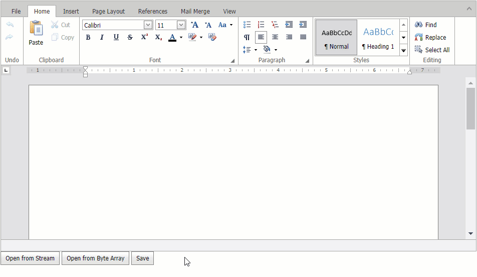

<!-- default badges list -->

<!-- default badges end -->
# Rich Text Editor for ASP.NET Web Forms - How to save/load documents to/from a database

This example demonstrates how to configure the [Rich Text Editor](https://docs.devexpress.com/AspNet/17721/components/rich-text-editor) control to work with a database.

Load a document from a database as a byte array and pass it to the control's [Open(String, DocumentFormat, Func<Byte[]>)](https://docs.devexpress.com/AspNet/DevExpress.Web.ASPxRichEdit.ASPxRichEdit.Open(System.String-DevExpress.XtraRichEdit.DocumentFormat-System.Func-System.Byte---)) method overload to open the document in the Rich Text Editor. The [Open(String, DocumentFormat, Func\<Stream\>)](https://docs.devexpress.com/AspNet/DevExpress.Web.ASPxRichEdit.ASPxRichEdit.Open(System.String-DevExpress.XtraRichEdit.DocumentFormat-System.Func-System.IO.Stream-)) method overload allows you to open a document loaded from the database as a stream.

The [Saving](https://docs.devexpress.com/AspNet/DevExpress.Web.ASPxRichEdit.ASPxRichEdit.Saving) event occurs when you call the [Save](https://docs.devexpress.com/AspNet/DevExpress.Web.ASPxRichEdit.ASPxRichEdit.Save) method or a user clicks the built-in **Save** or **SaveAs** command in the Ribbon UI. To save changes, handle the `Saving` event and update the data source.

## Files to Review

* [Default.aspx](./CS/ASPxRichEdit_Binding/Default.aspx) (VB: [Default.aspx](./VB/ASPxRichEdit_Binding/Default.aspx))
* [Default.aspx.cs](./CS/ASPxRichEdit_Binding/Default.aspx.cs) (VB: [Default.aspx.vb](./VB/ASPxRichEdit_Binding/Default.aspx.vb))

## Documentation

* [RichEdit Document Management](https://docs.devexpress.com/AspNet/401562/components/rich-text-editor/document-management)
* [Querying Data with the SqlDataSource Control](https://learn.microsoft.com/en-us/aspnet/web-forms/overview/data-access/accessing-the-database-directly-from-an-aspnet-page/querying-data-with-the-sqldatasource-control-cs)

## More Examples

* [Rich Text Editor for ASP.NET MVC - How to save/load documents from/to a database](https://github.com/DevExpress-Examples/mvc-richedit-save-and-load-documents-from-a-database)
<!-- feedback -->
## Does this example address your development requirements/objectives?

 

(you will be redirected to DevExpress.com to submit your response)
<!-- feedback end -->
